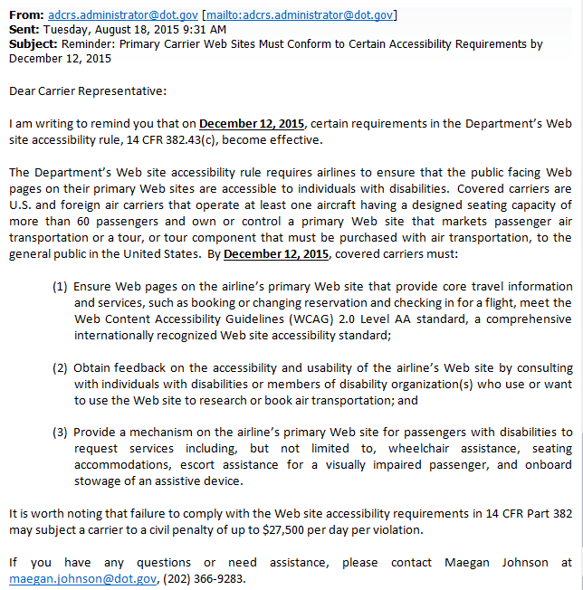

# US DOT의 메일 통보

60명 이상의 승객을 수용하는 좌석을 갖춘 항공기를 갖고 있는 미국에 취항하는 모든 항공사는 **2015년 12월 12일까지** 다음 3가지를 준수해야 합니다.

**항공사 웹사이트의 주요 핵심 기능 7가지에 대해 WCAG 2.0 LEVEL AA수준까지 준수**

* Booking or changing a reservation \(including all flight amenities\)
* Checking in for a flight
* Accessing a personal travel itinerary
* Accessing the status of a flight
* Accessing a personal frequent flyer account
* Accessing flight schedule
* Accessing carrier cantact information

**장애인이나 장애인 단체와 협의하여 항공사 웹사이트의 접근성 및 유용성 수준 확인**

**장애인 승객이 휠체어나 장애인 좌석, 항공기 탑승 지원이나 보조 장치를 탑재 신청을 할 수 있는 기능을 웹사이트에 제공**


위 내용을 위반할 경우 민사 처벌 대상이 되며 1일 당 최대 $27,500 부과될 수 있다.






