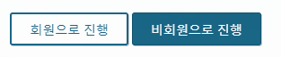

# 버튼을 왜 링크로 쓰는거지?

### 이것은 링크인가요?

&#x20;웹 페이지에 사용하는 수 많은 버튼과 링크들.... 버튼과 링크를 구별하여 꼭 사용해야 할까?\
\<a>와 \<button>은 기본 동작과 기능 뿐 아니라 키보드 인터랙션도 다르므로 키보드 사용자와 스크린리더 사용자에게 혼동을 가져온다.\
링크와 버튼은 다른 요소로 마크업을 해야 하고, 같은 기능은 동일한 요소로 시맨틱하게 마크업해야 한다.

#### 버튼인지를 먼저 판단하자.

버튼은 사용자가 양식을 제출해야 하거나, 팝업을 열거나, 동작을 실행 또는 취소 등 이벤트를 트리거할 때 사용하는 위젯으로 **엔터키**와 **스페이스바**로 동작이 되어야 한다.

#### 링크의 기능은 정말 단순하다.

링크는 주로 참조 자료를 제공하기 위해 사용하는 것으로 주로 타겟은 내부이거나 외부일 수 있으며, **엔터키**로만 동작이 된다.

### 문제발생



항공권 구매 시 회원으로 구매를 할 것인지, 비회원으로 구매를 할 것인지에 대해 선택하는 버튼을 누르면 각 케이스에 맞는 모달 다이얼로그가 뜨게 된다. 버튼 기능이지만  \<a>로 제작되어, 스크린리더 사용자는 이 버튼을 이해하는데 어려워했다.

### 해결방법

버튼을 \<a>요소로 제작된 것을 \<button>요소로 변경하거나 ARIA role 속성을 사용하여 버튼 역할을 명시해 주고 스페이스바로 사용할 수 있도록 스크립트 이벤트를 추가해야 한다.

일정과 개발에 영향을 최소화하기 위해 아래와 같이 role을 사용하여 해결하였다.&#x20;

```markup
<a href="#" role="button">회원으로 진행</a>
<a href="#" role="button">비회원으로 진행</a>
```

#### 브라우저에서 확인이 가능한 버튼과 링크의 정말 큰 차이

WIA-ARIA는 Native HTML을 사용할 수 없을 때에 사용해야 한다.  WAI-ARIA를 사용한다고 해서 Native HTML의 본질마저 바꿀 수는 없다.&#x20;



#### <mark style="color:orange;">AOA동영상 강의</mark>


