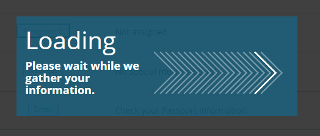

# 로딩 적용 사례

### 로딩인지.. 스크린리더가 멈춘건지.. 다시 리프레시!

일반적으로 페이지가 로딩 중인 경우 화면은 멈춰있고 스크린리더도 아무것도 읽지 않게 되면, 스크린리더 사용자들은 오류로 멈춘 것으로 오해하고 리프레시를 누르는 경우가 왕왕 있다.

항공편 검색이나 예약조회를 하게 되면 서버에서 데이터를 부르기 위해 로딩이 뜨게 된다. 이 때 시각적으로 로딩 중이라는 것을 보여주게 되는데 스크린리더 사용자에게도 동등하게 알려주어야야 한다.

### 다음의 2가지는 반드시 스크린리더가 읽어야 한다.

1. 로딩이 시작되었다는 것을 읽기
2. 로딩이 종료되었다는 것을 읽기



페이지가 로드될 때부터 aria-live 속성을 삽입한 비어있는 로딩의 시작과 종료 요소는 같이 존재한다.

```markup
<div id="loading-start" aria-live="assertive"></div>
<div id="loading-end" aria-live="assertive"></div>
```

### 로딩이 시작되었다는 것을 알리기

로딩이 시작되면 `role="alert"` 속성이 삽입되고,  비어있는 loading-start 안에 로딩 내용이 삽입된다.

```markup
<div id="loading-start" aria-live="assertive" role="alert">
    <div class="offscreen">please wait while we gather your information, 
    Loading...</div>
</div>
<div id="loading-end" aria-live="assertive"></div>
```

### 로딩이 종료되었다는 것을 알리기

로딩 소스는 삽입되었던 `role="alert"` 속성과 함께 일정 시간이 지나면 삭제되고, 하단 로딩 종료를 위한 소스에 종료되었다는 문구가 삽입된다.

```markup
<div id="loading-start" aria-live="assertive"></div>
<div id="loading-end" aria-live="assertive">
    <div class="offscreen">Loading has been completed</div>
</div>
```

로딩이 끝나면 삽입되었던 종료 소스도 삭제되고, 처음 존재했었던 소스만 남긴다.

```markup
<div id="loading-start" aria-live="assertive"></div>
<div id="loading-end" aria-live="assertive"></div>
```

스크린리더로 읽게 되면 아래와 같다.

> alert Please wait while we gather your information. Loading..
>
> \
> Loading has been completed.





**로딩 시작할 때만 role="alert" 속성이 삽입된 이유**\
role="alert" 속성은 스크린리더가 읽고 있는 것을 중지하고 주위를 환기시키고 집중할 수 있게 하기 때문에 로딩중이라는 것을 바로 인지할 수 있다.\
****하지만, 종료 시 role="alert" 속성을 넣게 되면 로딩 시작 문구를 중간에 끊어서 제대로 읽지 않기 때문에 종료에는 삭제하고 스크린리더가 읽던 것을 다 읽은 후에 종료되었다는 것을 읽도록 aria-live="assertive" 속성만 넣는다.


