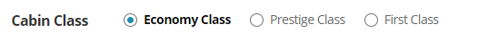

# 그룹에게는 그룹명을 알려주자

### 라디오 버튼만으로 이해가 되는걸까?

라디오버튼과 같이 두 개 이상의 그룹이 묶여 있는 경우에 시각적으로 그룹이라는 것이 표현이 되지만 스크린리더 사용자는 그 정보를 알 수가 없다.



### 문제발생

항공권 구매 시 좌석 등급을 선택해야 할 때, 이코노미/프레스티지/일등석을 라디오버튼으로 제작하였으나 시각적인 타이틀만 눈에 보일 뿐, 그룹으로 묶지 않아 스크린리더 사용자는 정보를 인지하지 못하기 때문에 이해하기 어렵게 된다.

```markup
<div id="classtxt">Cabin Class</div>
<ul>
    <li>
        <input id="economy" type="radio" value="economy" 
         checked="checked" name="cabin">
        <label for="economy">Economy Class</label>
    </li>
    <li>
        <input id="Prestige " type="radio" value="Prestige" name="cabin">
        <label for="Prestige ">Prestige Class</label>
    </li>
    <li>
        <input id="First" type="radio" value="First" name="cabin">
        <label for="First">First Class</label>
    </li>
</ul>
```

스크린리더로 듣게 되면 그룹 정보에 대한 내용은 없고  라디오 버튼 정보만 읽어 맥락 이해가 어렵다.

> 라디오버튼 선택됨   
> Economy Class 1/3

### 해결방안

전체를 감싸는 &lt;ul&gt;요소에 ARIA `role="group"`과 aria-labelledby를 사용하여 그룹으로 묶고 그룹 제목을 아래와 같이 명시한다.

```markup
<div id="classtxt">Cabin Class</div>
<ul role="group" aria-labelledby="classtxt">
    <li>
        <input id="economy" type="radio" value="economy" 
         checked="checked" name="cabin">
        <label for="economy">Economy Class</label>
    </li>
    <li>
        <input id="Prestige " type="radio" value="Prestige" name="cabin">
        <label for="Prestige ">Prestige Class</label>
    </li>
    <li>
        <input id="First" type="radio" value="First" name="cabin">
        <label for="First">First Class</label>
    </li>
</ul>
```

그룹정보를 명시하고 스크린리더로 듣게되면 아래와 같이 들리게 되며, 역순으로 포커스가 이동하여도 그룹정보를 읽어주게 된다.

> Cabin Class 그룹  
> 라디오버튼 선택됨   
> Economy Class 1/3


일반적으로 라디오 그룹으로 tab 키로 진입하면 선택된 라디오버튼으로 포커스가 이동한다.   
만약, 선택된 라디오 버튼이 없다면 순차이동일 경우는 첫번째 라디오 버튼, 역순인 경우 마지막 라디오 버튼으로 포커스는 이동된다.

단, JAWS에서는 버그가 있어 위 방식으로 이동하지 않는다.



라디오버튼만 그룹이 되는 것이 아니고, 생년월일이 따로 입력해야 할 때도 나뉘어져 있는 입력박스는 그루핑이 되어야 하고 그룹명이 필요하다.



