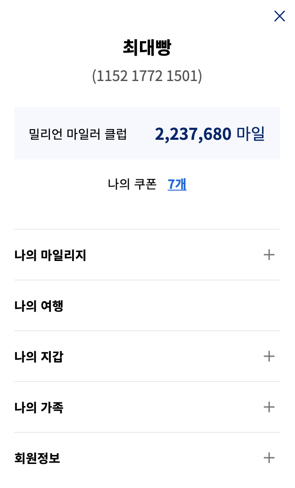

# 메뉴 적용 사례

### role=menu, menubar로 구현한 마이페이지 메뉴

메뉴를 구현하는 방법은 여러 가지가 있는데, 아래 화면의 마이페이지의 메뉴는 `role="menu"`와 `role="menubar"`로 구현하였다.

#### 상위 메뉴는 `role="menubar"`, 하위 메뉴는 `role="menu"`


전체 메뉴 컨테이너에 `role="navigation"`과 aria-label를 사용하여 메뉴 네비게이션임을 안내한다. 상위 메뉴에 `role="menubar"`와 `role="menuitem"`을 삽입하고 그 하위 메뉴에는 `role="menu"`와 `role="menuitem"`을 사용한다.  

상위 메뉴가 하위 메뉴를 가지고 있는 경우 `aria-haspopup="true"`속성을 삽입하여 하위 메뉴가 있음을 스크린리더에서 읽게 하고,  하위 메뉴가 펼쳐졌을 때는 `aria-expanded="true"`를 삽입하고 aria-controls 속성으로 하위 메뉴의 id 연결한다. 또한 하위 메뉴가 없는 상위 메뉴는 aria-haspopup 속성 자체가 삭제 되고, 펼쳐질 하위 메뉴가 없으므로 aria-expanded 와 aria-controls 속성 또한 삭제한다.

**"마일리지 사용 &gt; 항공 보너스"** 메뉴가 활성화 되었을 때 소스를 보면 다음과 같다.

```markup
<nav role="navigation" aria-label="마이페이지">
    <ul class="depth-1" role="menubar">
        <li role="menuitem" tabindex="-1">
            마이페이지
        </li>
        <li role="menuitem" aria-haspopup="true" aria-expanded="false" 
        aria-controls="menu1" tabindex="-1">
            나의 마일리지
            <ul role="menu" id="menu1" style="display:none">
                <li role="menuitem" tabindex="-1">
                    마일리지 현황
                </li>
                <li role="menuitem" tabindex="-1">
                    마일리지 상세 조회
                </li>
                <li role="menuitem" tabindex="-1">
                    마일리지 사후적립 신청
                </li>
            </ul>
        </li>
        <li role="menuitem" aria-haspopup="true" aria-expanded="true" 
        aria-controls="menu2" tabindex="0">
            마일리지 사용
            <ul role="menu" id="menu2">
                <li role="menuitem" tabindex="0">
                    항공 보너스
                </li>
                <li role="menuitem" tabindex="-1">
                    로고 상품
                </li>
                ...
            </ul>
        </li>
    </ul>
</nav>
```

### 키보드 인터랙션은 방향키를 사용

현재 활성화 된 메뉴는 탭키로 이동이 가능해야 하므로 해당 메뉴는 `tabindex="0"`을 삽입한다. 그 외의 메뉴는 `tabindex="-1"`을 삽입하여 방향키로 포커스가 이동할 수 있도록 한다.

상위 메뉴 간의 이동은 좌우 방향키로 이동하고 원하는 상위 메뉴에서 엔터키를 누르면 하위 메뉴가 펼쳐진다. 하위 메뉴 간의 이동은 상하 방향키로 이동할 수 있는데 하위 메뉴에 포커스가 있더라도 좌우 방향키 상위 메뉴 간 탐색이 가능하다. 

현재 대한항공은 리뉴얼 되어 아래 이미지와 같이 세로 메뉴바 스타일로 변경되었지만, WAI-ARIA를 이용하여 접근성을 구현하는 방법과 키보드 탐색 방법은 예전과 동일하다. 



