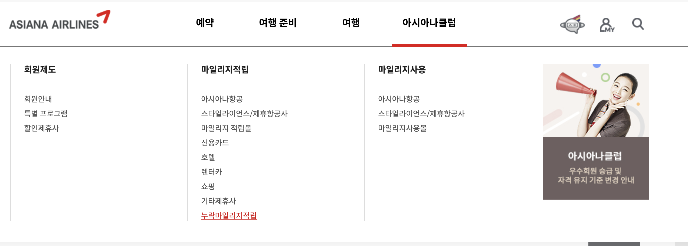
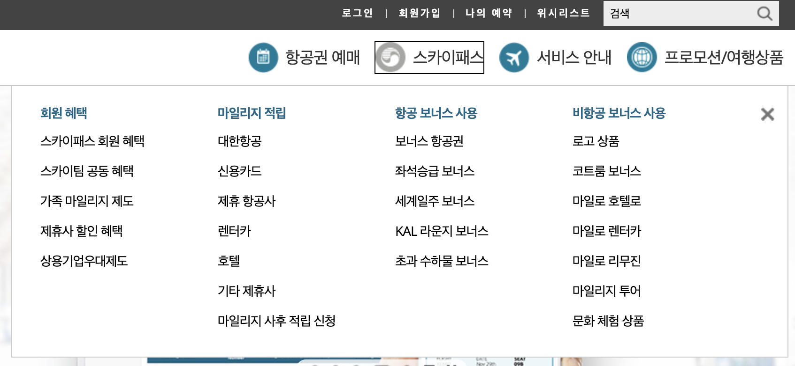

# 메인 네비게이션 구현 사례

### 무수히 많은 항공사의 메뉴는 어떻게 탐색할까?

아시아나 항공, 제주 항공, 티웨이 항공사 사이트의 메뉴 화면이다. 아래 3개의 항공사는 메인 메뉴 탐색을 탭키로 이동했을 때 자동으로 서브메뉴가 열리도록 구현하였다. 그런데, 탭키로 서브메뉴를 자동으로 열리게 한 것이 좋은 방법일까? 

아래 화면처럼 아시아나 항공 사이트에서 적립하지 못한 마일리지를 적립하기 위해 메뉴를 찾아보자. 메인 메뉴의 "아시아나클럽 &gt; 마일리지 적립 &gt; 누락마일리지적립" 메뉴를 이동하기 위해 정확히 탭키를 **100번** 눌러야 한다.

[https://flyasiana.com/C/KR/KO/index](https://flyasiana.com/C/KR/KO/index)



물론 아시아나 항공사도 국내 접근성 가이드라인에 맞게 구현했지만 이렇게 탭키로 모든 메뉴를 탐색하게 하는 것이 국내에서는 일반적으로 구현하는 방법이지만, 이 방법은 스크린리더 사용자를 정말 힘들게 하는 방법이다. 


### 탭키와 엔터키를 같이 사용해보자.

대한항공의 메뉴 화면은 아래와 같다. 4개의 메인 메뉴와 각각의 많은 서브 메뉴를 갖고 있다. 각 서브 메뉴로 이동하기 위해서 탭키를 누르면 4개의 메인 메뉴 간에 이동이 되고, 서브메뉴는 메인 메뉴에서 엔터키를 누르면 서브 메뉴가 펼쳐지고 다시 탭키를 누르면 서브 메뉴 간에 이동하도록 구현하였다.

이렇게 구현하면 원하는 메뉴로 탐색이 더 빠르고 쉬워진다.

[https://www.koreanair.com/korea/ko.html](https://www.koreanair.com/korea/ko.html)



 위와 같이 구현하기 위해서는 WAI-ARIA 속성을 사용하여 역할과 상태를 알려주어야 하며, 소스를 보면 다음과 같다.

```markup
<nav role="navigation" aria-label="메인">
    <ul class="depth-1">
        <li>
            <button aria-expanded="false" aria-controls="menu1">
            항공권 예매
            </button>
            <div id="menu1" aria-hidden="true" style="display:none">
                <h2><a href="#">항공권 예매</a></h2>
                <ul class="depth-2">
                    <li><a href="#">일반 예매</a></li>
                    ...
                </ul>
            </div>
        </li>
        <li>
            <button aria-expanded="true" aria-controls="menu2">
            스카이패스
            </button>
            <div id="menu2" style="display:block">
                <h2><a href="#">회원 혜택</a></h2>
                <ul class="depth-2">
                    <li><a href="#">스카이패스 회원 혜택</a></li>
                    <li><a href="#">스카이팀 공동 혜택</a></li>
                    ...
                </ul>
            </div>
        </li>
        ...
    </ul>
</nav>


```

전체 메뉴는 ul, li 태그로 구조화하였고,  감싸고 있는 컨테이너에 `role="navigation"`과 aria-label 속성을 사용하여 제목을 읽도록 설정하였다. 

그리고 각 메인 메뉴 aria-expanded 속성을 사용하여 현재가 펼쳐진 상태인지, 접힌 상태인지 상태를 알려주고 aria-controls 속성을 사용하여 서브 메뉴와 메인 메뉴를 연결한다. 접힌 서브 메뉴는 `display:none`속성과 함께 `aria-hidden="true"` 속성을 사용하여 스크린리더에서 읽히지 않도록 하고 화면에서 숨긴다. 

위와 같이 구현하고 "**스카이패스 &gt; 회원 혜택**" 메뉴로 들어가면서 스크린리더로 들어보자.

> 메인 navigation  
> 목록   
> 항공권 예매 버튼 축소됨   
> 스카이패스 버튼 축소됨 //엔터키클릭  
> 확장됨   
> 회원 혜택 헤딩 레벨 2  
> 회원 혜택 링크

이처럼 WAI-ARIA 속성 몇 개를 활용하면 스크린리더 사용자들은 물론 키보드 사용자들도 몇 번의 키보드 선택으로 빠르게 원하는 메뉴로 이동이 가능하게 된다. 

물론 WAI-ARIA 쓴다고 키보드 인터랙션이 자동으로 구현되지 않으므로 스크립트를 통한 개발은 필요하다.

