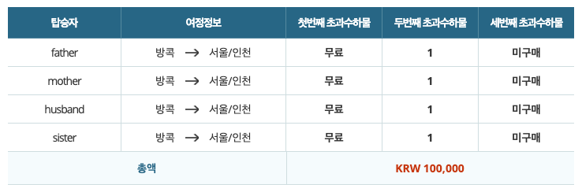

# 이해하기 쉬운 데이터 테이블 적용 사례

### 제목행과 제목열에 모두 th와 scope를 사용하자.

아래와 같이 방콕에서 인천으로 오는 항공편에 초과수하물을 4명의 가족이 1개씩 추가하여 구매 정보를 보여주는 테이블이 있다. 이런 테이블을 스크린리더를 사용하는 시각 장애인들에게도 쉽게 이해할 수 있는 테이블로 만들 수 있다.



첫번 째 제목 행은 &lt;th&gt;로 마크업하고 scope="col" 속성을 사용하고, 테이블의 캡션은 "탑승자 별 방콕출발 인천도착 여정에 구매한 초과수하물 개수 현황"이라고 제공한다.

그리고 테이블을 보면 어두운 배경의 제목행이 아닌 탑승자 열도 제목열이 될 수 있다. 제목행과 제목열을 항상 지정해두면 데이터 열을 탐색할 때 빠르게 테이블 정보를 탐색할 수 있다. 마크업 소스는 다음과 같다. 

```markup
<table>
    <caption>탑승자 별 방콕출발 인천도착 여정에 구매한 초과수하물 개수 현황</caption>
    <thead>
        <tr>
            <th scope="col">탑승자</th>
            <th scope="col">여정정보</th>
            <th scope="col">첫번째 초과수하물</th>
            <th scope="col">두번째 초과수하물</th>
            <th scope="col">세번째 초과수하물</th>
        </tr>
    </thead>
    <tbody>
        <tr>
            <th scope="row">father</th>
            <td>방콕 출발 서울/인천 도착</td>
            <td>무료</td>
            <td>1개</td>
            <td>미구매</td>
        </tr>
        <tr>
            <th scope="row">mother</th>
            <td>방콕 출발 서울/인천 도착</td>
            <td>무료</td>
            <td>1개</td>
            <td>미구매</td>
            ....
    </tbody>
</table>
```

테이블을 탐색 시 JAWS에서는 ctrl + alt + 방향키를 사용하게 되는데 데이터 열을 읽을 때 연관된 제목행과 제목열을 읽고  ctrl + alt + 5\(numpad\)를 누르면 현재의 데이터 열의 제목열과 제목행을 같이 읽어 이해가 쉬워진다. 


