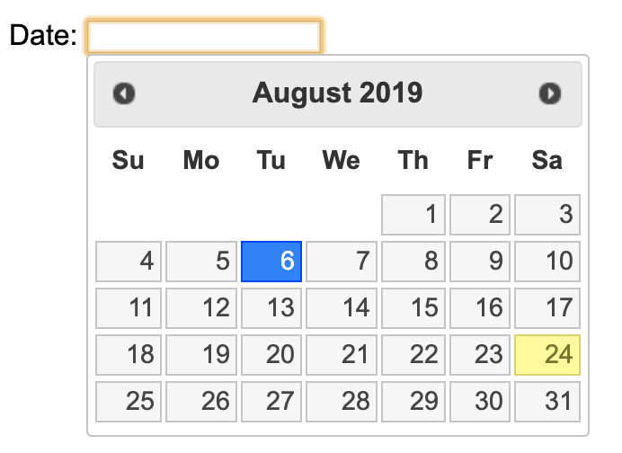

# 날짜 입력 적용 사례

### 접근성이 좋지 않은 Jquery UI datepicker

Jquery 공식 홈페이지에 있는 날짜선택기 화면이다. 입력박스에 포커스가 이동하면 자동으로 캘린더가 열리지만 캘린더가 열렸다는 것을 알 수도 없고 키보드로 접근을 할 수 없어 날짜 선택이 어렵다.

또한 직접 입력 방법은 유연성이 없어 정확한 포맷으로 입력하지 않으면 오류가 발생한다.



### 날짜 입력은 최대한 유연하게 제작하자.

날짜 표기는 다양하다. 국가별 문화차이로 일자를 먼저 입력할 수도 있고 "/"를 입력할 수도 있고 "-"를 입력할 수도 있다. 표준화되어 있지 않은 입력 방법 때문에 시각장애인은 더욱 날짜 선택이 어려워하고 불편해 하게 된다.

대한항공은 날짜 입력 방법을 최대한 유연한 방법으로 제작하였다. 연도부터 입력해야 하지만 일자를 먼저 입력해도 오류가 나지 않으며 "-" 대신 "/"를 입력해도 오류가 나지 않도록 최대한 입력 방법을 쉽게 구현했다.


또한 실제로 화면에 보이는 것과 스크린리더에서 읽는 문구를 다르게 하였는데, YYYY-MM-DD는 JAWS에서 네 자리 연도를 세 자리로 읽은 이슈가 있기 때문이다. YYYY-MM-DD는 스크린리더에서 읽지 않도록 하고 &lt;label&gt; 태그 안에 실제 입력 포맷 e.g. 2016-12-01을 읽게 제작하였다.

소스를 보면 아래와 같다.

```markup
<label for="date" class="offscreen">
    Start Date (e.g. 2016-12-01)
</label>  
<span aria-hidden="true">Start Date (YYYY-MM-DD)</span>    
<input id="date" type="text" maxlength="10">
<button>Select the date</button>
```

날짜를 선택하는 버튼을 클릭하면 모달 다이얼로그로 캘린더가 뜨게 되는데 role="dialog"와 함께 aria-labelledby 속성을 사용하여 스크린리더가 캘린더가 열렸다는 것을 바로 알 수가 있다.

스크린리더로 들어보면 다음과 같다.

> //입력박스 진입 시  
> 출발일 \(e.g. 2016-12-01\) 편집창  
>   
> //캘린더 버튼 이동 시   
> 일자 선택하기 버튼   
>   
> // 캘린더 버튼 클릭 시  
> 날짜를 선택하여 주십시오 대화상자

캘린더의 접근성 적용 사례는 작년에 사례를 발표한 것이 있으 아래 링크를 참고하자.




실제로 많은 시각장애인들 날짜를 캘린더로 선택하기 보다는 직접 입력하는 것을 선호한다고 하는데 그 이유는 접근성을 준수하여 구현된 캘린더가 많지 않기 때문이다. 캘린더의 접근성 준수가 어렵다면 입력 방법을 최대한 유연하게 개발하는 것이 중요하다.



