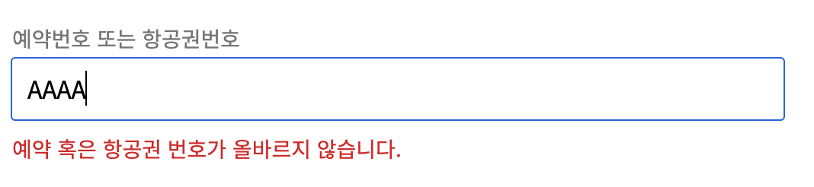

# 오류메시지 종류별 적용 사례

사용자는 웹사이트를 이용하면서 다양한 오류메시지를 만나게 된다. 폼 입력이 많은 웹페이지의 경우 오류메시지를 만날 확률은 더욱 높아진다.&#x20;

## 오류메시지를 만나게 되면 사용자는 어떻게 할까?

아마도 오류가 발생했다는 상황을 인지하고 그 오류가 어디에서 발생했는 지 발생한 이유가 무엇인 지를 먼저 찾게 된다. 그리고 오류메시지를 읽고 해결 방안을 찾아서 다시 시도하여 하고 싶었던 요청을 잘 완료했길 바랄 것이다.

그럼 시각장애인과 같은 화면이 보이지 않는 사용자도 비장애인과 동일하게 행동하게 될까?\
다양한 상황에서 다양한 오류메시지를 만나게 되는 항공사 웹사이트에서는 어떤 오류메시지 종류가 있으며 그 오류메시지를 어떻게 구현하여 접근성을 준수 하였는 지를 알아보자.

***

### 폼 입력 오류

항공사 웹사이트에는 성이나 이름, 예약번호, 탑승일 등 시용자가 직접 정보를 입력해야 하는 폼이 상당히 많다.  \
정보를 잘못 입력했거나 누락되었을 때는 아래 화면과 같이 입력 박스 하단에 오류 메시지가 즉시 표출되는데 비장애인이던 장애인이던 동일하게 오류를 인지하고 오류 메시지를 읽을 수 있게 구현했다.

<div align="left">

<figure><figcaption></figcaption></figure>

</div>

소스는 다음과 같다.

```html
<label for="pnr">예약번호 또는 항공권 번호</label>
<input type="text" id="pnr" aria-invalid="true" aria-describedby="error-msg">
<div id="error-msg">예약 혹은 항공권 번호가 올바르지 않습니다.</div>
```

오류가 발생하면 포커스는 해당 입력박스로 이동시켜 오류 발생 지역을 즉각 알려준다. 그리고 입력박스에 aria-invalid="true"와  aria-describedby 속성을 삽입하여 화면에 보이는 오류메시지와 연결한다.

위와 같이 구현하면 스크린리더를 사용하는 장애인들도 동일하게 오류를 인지하고 해결할 수 있게 되고 스크린리더는 다음과 같이 읽는다.

> 예약번호 또는 항공권 번호 편집창 입력 오류
>
> 예약 혹은 항공권 번호가 올바르지 않습니다. AAAA

***

### 서버 데이터 오류

대부분의 웹사이트는 아이디나 비밀번호 두 개 중 하나라도 잘못 입력하면 오류가 발생하는 데 보안 등의 이슈로 아이디를 잘못 입력 하였는 지, 비밀번호를 잘못 입력 하였는 지를 알 수 없도록 되어 있다.

이런 경우는 대부분 특정 입력박스와 관련있는 오류가 아니지만 중요한 오류 상황이므로 사용자는 바로 인지할 수 있어야 하므로 페이지 제목 \<h1> 바로 밑 주요 영역에 오류 메시지를 눈에 잘 띄게 배치한다.

<div align="left">

<figure><figcaption></figcaption></figure>

</div>

소스는 다음과 같다.


```html
<div class="error-box" tabindex="-1">
일치하는 회원정보가 없습니다. 아이디 또는 비밀번호를 확인해 주세요.
</div>
```


오류 문구는 \<div> 태그 안에 삽입되고 \<div> 태그에 tabindex="-1"을 삽입하고 키보드 포커스를 이동시켜서 스크린리더가 즉시 오류 문구를 읽을 수 있도록 설정한다.

실제 소스는 여기서 끝이지만 더 나은 방법으로 개선한다면 "아이디 다시 입력하기"와 같은 링크를 삽입하여 바로 포커스를 이동시키면 오류를 인지한 후에 오류를 바로 해결할 수 있는 방법까지 안내할 수 있게 된다.

스크린리더는 다음과 같이 읽는다.

> //로그인 버튼 (클릭)
>
> 일치하는 회원정보가 없습니다. 아이디 또는 비밀번호를 확인해 주세요.

***

### 상황 오류

상황 오류는 특정 UI에서 사용자가 선택이 불가한 상황을 안내하는 경우이다.\
다음과 같이 탑승일을 선택하는 캘린더에서 현재 날짜를 기준으로 이전 날짜는 선택할 수 없으며 시각적으로는 흐린 그레이 색상으로 선택이 불가능 함을 안내하고 있다.&#x20;

<div align="left">

<figure><figcaption></figcaption></figure>

</div>

하지만 화면을 볼 수 없는 사용자는 시각적 정보를 알 수 없는 데 이런 상황에는 다음과 같이 구현할 수 있다.&#x20;

```html
<div role="alert">이전 날짜를 선택할 수 없습니다.</div>
// 또는
<div aria-live="assertive">이전 날짜를 선택할 수 없습니다.</div>
```

오류 메시지는 비어있는 노드에 오류가 발생할 때 즉시 노드가 삽입되고 role="alert"이나 aria-live="assertive" 속성으로 인해 스크린리더가 바로 오류 상황을 안내 할 수 있다.

스크린리더 음성은 다음과 같다.

> //12일 날짜에서 왼쪽방향키 누를 시
>
> 알림 이전 날짜를 선택할 수 없습니다.

