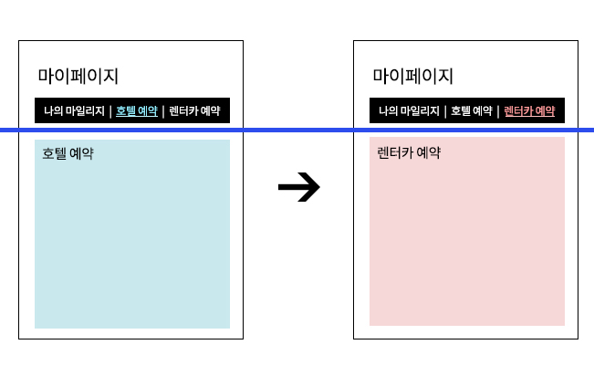
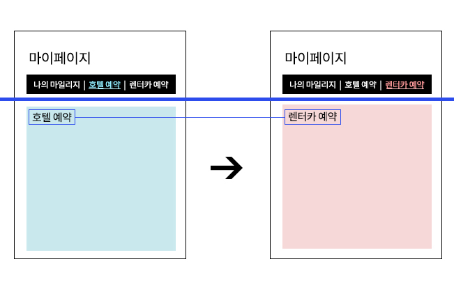

# 전환되지 않는 페이지의 포커스

### 페이지가 이동되었다는 걸 스크린리더도 알까?

AJAX 개발 방식과 같이 페이지가 전환되지 않거나 리플레시 되지 않고 헤더를 제외한 콘텐츠 부분만 변경되는 방식은 이제는 일반적이다. 시각적으로는 화면의 변화를 감지하고 인지할 수 있지만 스크린리더 사용자들은 화면 상의 변화를 인지하기 어렵다.

이유는 스크린리더는 페이지가 전환이 되면  title을 읽어주고 페이지 내에 몇 개의 링크가 있는지 자동으로 읽어주어 페이지가 전환되었다는 것을 스크린리더 사용자들도 알 수 있는데, 페이지가 전환되지 않으면 변화를 인지하지 못하고 아무것도 읽지 않는다.

### 문제발생

호텔 예약 페이지에서 렌터카를 예약하려고 메뉴를 눌러 이동했으나 파란색 라인 아래의 화면만 변경되어 스크린리더는 렌터카 페이지로 이동했다는 것을 인지하지 못한다.

스크린리더가 아무것도 읽지 않자 다시 렌터카 예약 메뉴를 반복적으로 누르게 된다.

### 해결방안

메뉴가 변경되어도 페이지 전환이 되지 않아 리플레시가 되지 않으므로, 메뉴를 선택하면 페이지의 제목인 "호텔 예약"과 "렌터카 예약"에 해당되는 \<h2>요소로 `tabindex="-1"` 을 삽입하고 포커스를 자동으로 이동시켰다.&#x20;

그리고 해당 영역에서 벗어나면 tabindex 속성을 삭제하였다.

위와 같이 수정하고 스크린리더를 들어보면 아래와 같이 들리게 된다.

> 호텔 예약 2/3 \
> // Enter키 누르면\
> 호텔 예약\
> 헤딩 레벨 2

> 렌터카 예약 3/3 \
> // Enter키 누르면\
> 렌터카 예약 \
> 헤딩 레벨 2

#### <mark style="color:orange;">AOA동영상 강의</mark>


