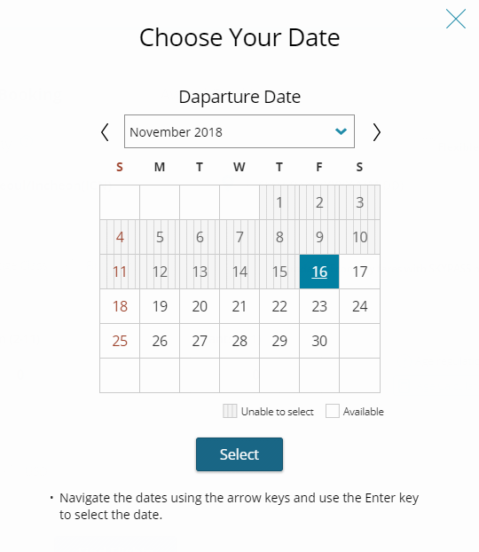
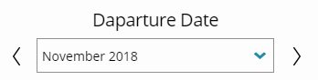
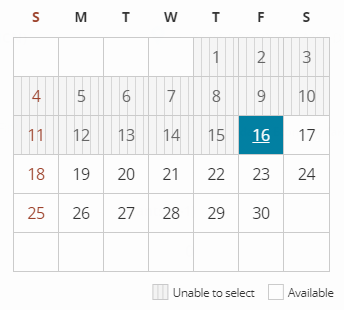

# Date Picker 적용사례

Date picker는 모든 브라우저에서 동일하게 지원하는 Native HTML과 Role이 없기 때문에 `role="application"`을 사용하고, 키보드 운용방법을 제공한다. 

### Date Picker는 다음의 정보를 읽을 수 있어야 한다.

* Date Picker의 키보드 운용방법
* 현재 탐색하는 날짜의 현재 연도, 월, 일, 요일
* 선택이 불가능한 날짜와 가능한 날짜
* 선택이 된 날짜



### 월을를 선택하는 영역은 구분  role="navigation"



날짜 탐색 영역 위의 월을 선택하는 부분은 `role="navigation"`으로 구분하고 보이는 레이블을 아래와 같이 마크업한다. 

```markup
<h2 id="year-title">Departure Date</h2>
<div role="navigation" aria-labelledby="year-title">
    <button>Previous Departure Month</button>
    <button>Next Departure Month</button>
    <select title="select start date month/year">
    ...
</div>
```

### 날짜를 선택하는 영역의 구분  role="grid"

role="grid"는 시각적으로는 표 형태이지만, 방향키 등을 통해 탐색하거나 인터랙션이 필요할 때 사용할 수 있는 role이다. 

전체 컨테이너 역할을 하는 &lt;table&gt; 요소에  `role="grid"`를 삽입하고 각각의 &lt;th&gt;에`role="columnheader"`, &lt;tr&gt;에 `role="row"`, &lt;td&gt;에 `role="gridcell"`을 삽입한다. 그리고  `role="grid"` 안에서 탐색방법은 주로 방향키를 사용하기 때문에 포커스가 이동할 수 있도록 tabindex를 각 gridcell 에 삽입하였다. 



### 천상천하 유아독존 aria-label

Date picker 는 스크린리더가 읽어야 하는 정보는 상당히 많다. 현재 날짜, 요일, 월, 선택할 수 있는 날짜, 선택할 수 없는 날짜, 오늘, 선택한 날짜 등.... 이 많은 정보를 어떻게 간단명료하게 전달할 수 있을지를 고민해야 했다.

이처럼 복잡한 정보를  제공할 경우에는 aria-label을 제공하는 것이 가장 쉽다. 왜냐하면 aria-label의 장점이자 단점은 aria-label을 사용하게 되면 aria-label만 읽고 다른 것들은 무시한다는 것이다.

각 &lt;th&gt;와 &lt;td&gt; 안에 정보를 잘 넣는다고 하여도 스크린리더 버전별로의 수많은\(?\) 버그와 때에 따라 달라질 수 있는 오류들 대응하기가 쉽지 않기 때문이다.  aria-label로 제공해야 하는 다양한 정보를  모두 삽입했다. 

**만약, 선택한 날짜가 금요일이고 16일이며, 선택이 가능하고, 오늘이라고 한다면, 아래와 같이 코드를 작성할 수 있다.**

```markup
<table role="grip" aria-labelledby="current-year">
//현재 월과 연도를 알려주는 요소의 id와 aria-labelledby 연결
...
<td tabindex="-1" aria-label="friday, 16, today, available, selected">16</td>
...
</table>
```

그리고, 스크린리더로 현재 날짜로 진입하면 아래와 같이 읽는다.

> November 2018 table  
> friday, 16, available, today, selected row 4

### 연도와 월은 변경될 때만 알려주기

날짜를 이동할 때마다 연도와 월까지 계속 읽게 되면 정보의 양이 너무 많기 때문에 월과 연도는 변경될 때만 읽어줄 수 있도록 상단 `role="navigation"`영역에 aria-live를 삽입하였다.

```markup
<h2 id="year-title">Departure Date</h2>
<div role="navigation" aria-labelledby="year-title">
    <button>Previous Departure Month</button>
    <button>Next Departure Month</button>
    //월과 연도가 변경될 때마다 변경
    <div class="offscreen" id="KE1542367602716-26-dummy0" aria-live="assertive">
        <span>December 2018</span>
    </div>
    <select title="select start date month/year">
    ...
</div>
```


현재 셀렉트박스로 월을 변경해도 현재 월/연도를 읽고, aria-live 내의 정보도 업데이트되어 두 번씩 들리게 되는데 2015년에는 JAWS의 버그로 셀렉트박스로 변경해도 선택한 월 정보가 들리지 않았다.

버그가 이미 수정되었지만 같이 소스를 수정하지 않은 건 함정...


### 키보드 인터랙션

* 이전 날짜와 다음 날짜 탐색은 좌우 방향키로 이동한다.
* 상하 방향키를 누르면 이전/다음주 같은 요일로 이동한다.
* Home을 누르면 현재 월의 선택 가능한 첫번째 날짜, End키를 누르면 현재 월의 선택 가능한 마지막 날짜로 이동한다.
* Page Up키를 누르면 이전 달 같은 날짜로 이동하고, Page Down키를 누르면 다음 날 같은 날짜로 이동한다.


NVDA의 버그로 방향키로 날짜 탐색 시 포커스가 이동만 해도 selected라고 읽기 때문에, 각각의 셀에 aria-selected="false"를 삽입하였다.


