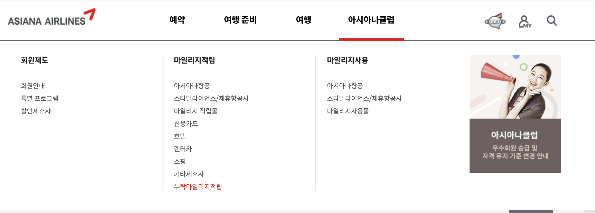
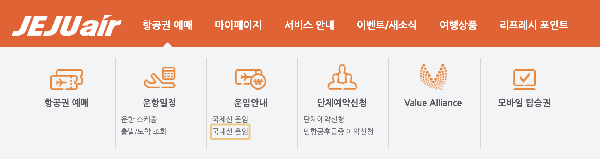
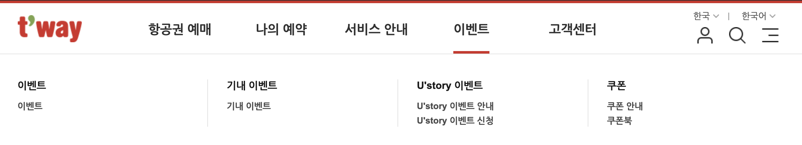
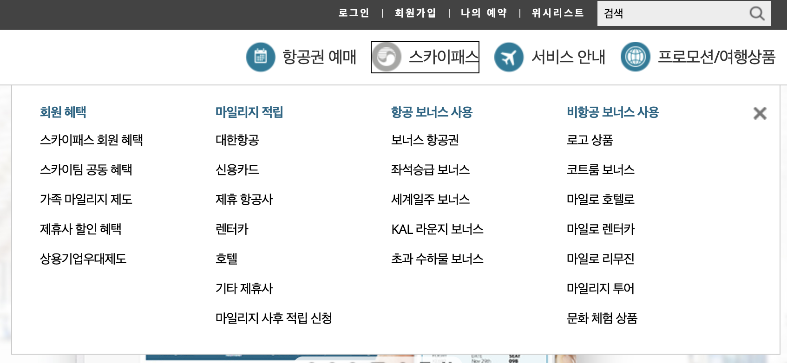

# 메인 네비게이션 구현 사례

### 무수히 많은 항공사의 많은 메뉴는 어떻게 탐색할까?

아시아나 항공, 제주 항공, 티웨이 항공사 사이트의 메뉴 화면이다. 아래 3개의 항공사는 메인 메뉴 탐색을 탭키로 이동할 수 있도록 구현하였다.  
그런데, 탭키로 모든 메뉴를 이동할 수 있게 한 것이 좋은 방법일까? 

아래 화면처럼 아시아나 항공 사이트에서 적립하지 못한 마일리지를 적립하기 위해 메인 메뉴의 "아시아나클럽 &gt; 마일리지 적립 &gt; 누락마일리지적립" 메뉴를 이동하기 위해 정확히 탭키를 **100번** 눌러야 한다.



국내 접근성 가이드라인에 맞게 구현했지만 이렇게 탭키로 모든 메뉴를 탐색하게 하는 것이 국내에서는 일반적으로 구현하는 방법이지만, 스크린리더 사용자를 정말 힘들게 하는 방법이다. 





### 탭키와 엔터키를 같이 사용해보자.

대한항공의 메뉴 화면은 아래와 같다. 4개의 메인 메뉴와 각각의 많은 서브 메뉴를 갖고 있다. 각 서브 메뉴로 이동하기 위해서 4개의 메인 메뉴에서 엔터키를 누를 때 서브 메뉴가 펼쳐지도록 구현하였다.



 위와 같이 구현하기 위해서는 aria 속성을 사용하여 역할과 상태를 알려주어야 하는데, 소스를 보면 다음과 같다.

```markup
<nav role="navigation" aria-label="메인">
    <ul class="depth-1">
        <li>
            <button aria-expanded="false" aria-controls="menu1">
            <div id="menu1" aria-hidden="true" style="display:none">
                <h2><a href="#">항공권 예매</a></h2>
                <ul class="depth-2">
                    <li><a href="#">일반 예매</a></li>
                    ...
                </ul>
            </div>
        </li>
        <li>
            <button aria-expanded="true" aria-controls="menu2">
            <div id="menu2" style="display:block">
                <h2><a href="#">회원 혜</a></h2>
                <ul class="depth-2">
                    <li><a href="#">스카이패스 회원 혜</a></li>
                    <li><a href="#">스카이팀 공동 혜택</a></li>
                    ...
                </ul>
            </div>
        </li>
        ...
    </ul>
</nav>


```

전체 메뉴를 감싸고 있는 컨테이너에 role="navigation"과 aria-label 속성을 사용하여 제목을 지정하였다. 그리고 각 메인 메뉴는 aria-expanded 속성을 사용하여 현재가 펼쳐진 상태인지, 접힌 상태인지 상태를 알려주고 aria-controls 속성을 사용하여 서브 메뉴와 메인 메뉴를 연결한다. 접힌 서브 메뉴는 aria-hidden 속성을 사용하여 스크린리더에서 읽히지 않도록 하고 화면에서 숨긴다. 

위와 같이 구현하고 스크린리더로 들어보자.

