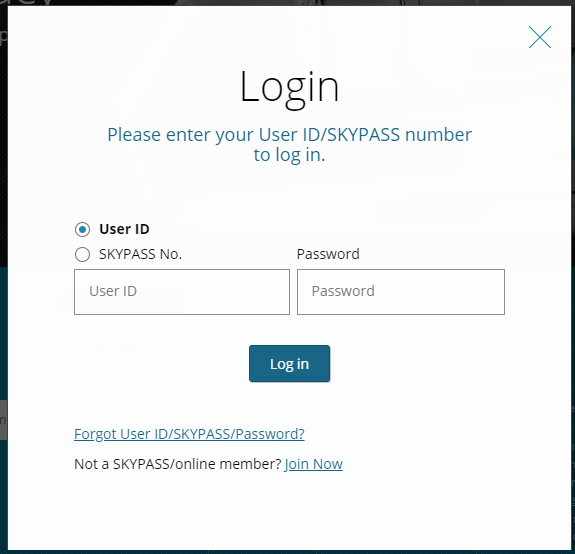

# Modal Dialog 적용 사례

### Non Nodal vs Modal

논모달과 모달은 목적에 따라 선택하여 구현할 수 있는 다이얼로그 형태이다. 모달은 배경이 어두워지고 다이얼로그를 제외한 나머지 부분은 컨트롤을 할 수 없게 하기 위해 사용하며, 논모달은 이와는 반대로 다이얼로그와 함께 배경 콘텐츠도 컨트롤 할 수 있으며 배경이 어두워지지도 않는다.

### Modal Dialog



모달 다이얼로그는 위로 뜨는 다이얼로그에만 집중시키기 위해 배경 콘텐츠는 컨트롤을 할 수 없으며 배경도 어두워지게 된다.

스크린리더 사용자에게도 다이얼로그가 뜬 상태라는 것을 알리기 위해 다이얼로그 전체 컨테이너에 role="dialog"를 삽입하고 다이얼로그의 제목을 aria-labelledby 속성으로 연결한다.

```markup
<div role="dialog" aria-labelledby="title-dialog">
    <div role="document" tabindex="-1">
        <h2 id="title-dialog">Login</h2>
         콘텐츠 영역
     </div>
</div>
```

### 

