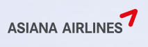

# 대문자로만 표현해야 할 때

### **SKYPASS 에스케이와이패스** vs **Skypass 스카이패스**

스크린리더는 영어 단어를를 읽을 때 대문자와 소문자를 읽는 방법이 다르다.   
대문자로만 사용했을 때는 쉽게 알 수 있는 단어를 제외하고는 모두 한글자씩 따로 읽게 된다.


text-transform 속성을 사용하여 대문자로 표현하여도 NVDA 스크린리더는 보여지는 대로 읽기 때문에 해결 방법이 아니다.


메뉴명 SKYPASS는 **"스카이패스"**가 아닌 **"에스케이와이피에이에스에스"**로 읽고 있어 수정이 필요했다.


대소문자 조합으로 보여지는 것을 기본으로 하되 SKYPASS와 같이 브랜드 정책과 관련있는 단어들은 대문자로 보여지되 스크린리더에서도 잘 읽을 수 있도록 아래 코드와 같이 수정하였다.

```markup
<button>
<span aria-hidden="true">SKYPASS</span> <span class="offscreen">Skypass</span>
</button>
```

aria-hidden 속성으로 대문자 단어를 노드로 감싸서 읽지 않게 하고, 화면에 보이지 않는 대소문자를 삽입하면 스크린리더에서는 "스카이패스"로 정확히 읽게 된다.



아시아나 항공도 대문자로 되어 있는데 NVDA로 읽게 되면 "에이에스아이에이엔에이 에어라인"으로 읽고 있다. 동일한 방법으로 수정하면 브랜드 네임을 제대로 읽게 할 수 있다.

```markup
<button>
<span aria-hidden="true">ASIANA</span> <span class="offscreen">asiana</span> AIRLINE
</button>
```


