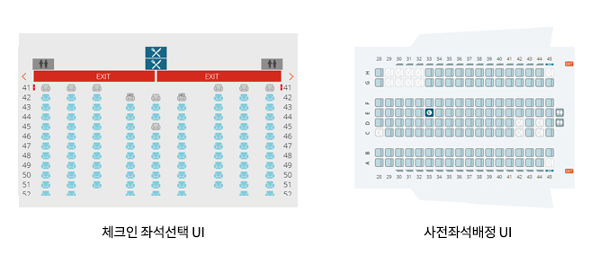

# 동일한 좌석 선택인데 UI가 달라요

### 체크인 좌석 선택 vs 사전 좌석 배정

항공사 웹 사이트에는 2가지 방법으로 좌석을 미리 선택할 수 있다. 웹 체크인에서 좌석을 선택하는 방법과 사전좌석배정으로 좌석을 선택하는 방법이다.

사용자에게는 좌석을 선택하는 동일한 기능임에도 불구하고 초기에는 아래 화면과 같이 비행기 방향, 상호 인터랙션 방법이 크게 다르게 되어 있었다. 

### 문제 발생

기본적인 접근성이 두 개의 UI 모두 준수하고 있어도, 사용자가 UI 내에서 인터랙션 하는 방법이나 구성 요소, 방향 등이 크게 다르기 때문에 사용자는 동일한 기능임에도 다르게 수행해야 하는 어려움이 있다.

### 해결방안

해결방안은 딱 한가지이다. 동일한 UI로 통일하여 사용자에게 제공해야 한다는 것이었고, 현재는 사전좌석배정 UI를 체크인 좌석 선택 기능에도 동일한 UI를 제공하고 있다.

