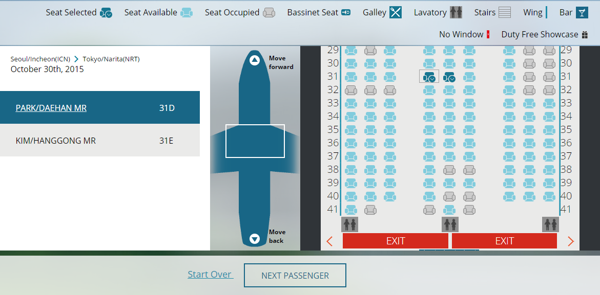
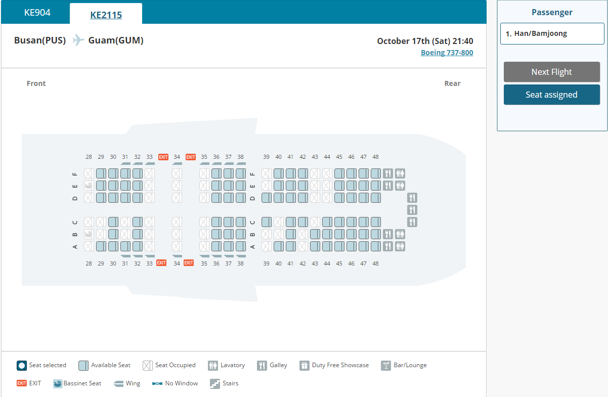

# 동일한 기능의 서로 다른 UI

### 체크인 좌석 선택 vs 사전 좌석 배정

항공사 웹 사이트에는 2가지 방법으로 좌석을 미리 선택할 수 있다. 웹 체크인에서 좌석을 선택하는 방법과 사전좌석배정으로 좌석을 선택하는 방법이 있다.

사용자에게는 좌석을 선택하는 동일한 기능임에도 불구하고 초기에는 아래 화면과 같이 비행기 방향, 상호 인터랙션 방법이 크게 다르게 되어 있었다. 


사전좌석배정은 항공권 예매와 함께 좌석을 미리 지정할 수 있는 기능이며, 체크인 좌석배정은 국제선은 출발 48시간 전, 국내선은 24시간 전에 체크인과 함께 좌석 배정을 하는 기능이다.


### 문제 발생

기본적으로 두 개의 좌석 배정 기능 모두 접근성을 준수하고 있어도, 사용자가 UI 내에서 인터랙션 하는 방법이나 구성 요소, 방향 등이 크게 다르기 때문에 사용자는 동일한 기능임에도 다르게 수행해야 하는 어려움이 있다.

1. **비행기의 방향이 체크인 좌석선택은 세로방향, 사전좌석배정은 가로 방향으로 되어 있음.**
2. **좌석등급별 이미지가 다른 스타일로 되어있음.**
3. **좌석을 선택하는 방법이나 플로우가 상이함.**

### 해결방안

해결방안은 딱 한가지이다. 동일한 UI로 통일하여 사용자에게 제공해야 한다는 것이었고, 현재는 사전좌석배정 UI를 체크인 좌석 선택 기능에도 동일한 UI를 제공하고 있다.

좌석배정 기능의 접근성 준수 방법은 다음 섹션에서 자세히 설명하겠다.

