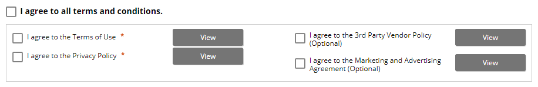

# 화면을 보는 스크린리더 사용자

### 실제로 시각장애인 중 전맹은 20% 이하에 불과하고 80%는 시력이 떨어지는 저시력장애인이다. \(서울장애인홈페이지 \)

대개 스크린리더 사용자들은 전맹이기 때문에 화면을 보지 않고 스크린리더 음성으로만 웹페이지를 탐색할거라 생각한다. 하지만 스크린리더를 사용하면서 화면을 보는 시각장애인들이 있기 때문에 스크린리더가 읽는 곳을 화면에서 보이지 않으면 이해가 어렵게 된다.

### 첫 번째 문제발생

css 속성을 사용하여 하단 영역에 화면에 보이지 않아야 하는 숨김콘텐츠를 제작한다. 그 후 스크린리더를 실행을 하게 되면, 스크린리더가 화면의 하단 영역까지 탐색을 하다가 갑자기 스크롤이 상단으로 이동해 버린다.

아래 예시 화면을 확인해 보자.



```css
.offscreen{
position: absolute;
top:-10000px
overflow: hidden;  
}
```

`top:-10000px` 과 같이 음수값 설정으로 위치 값이 변경되어  스크롤이 자동으로 상단으로 이동하게 되고 스크린리더가 읽고 있는 화면이 사라지게 된다.

### 첫 번째 문제해결

콘텐츠를 숨기기 위해 위치 값이 변경되어 스크롤을 제어하지 않도록 하기 위해 css의 음수값을 삭제하고 아래와 같이 공통 적용하여 해결한다.

아래와 같이 css를 적용하면 화면에서 보이지 않게 되고, 스크린리더로 읽어도 화면 스크롤 변화를 방지할 수 있다.

```css
.offscreen{
  position: absolute;
  clip: rect(1px 1px 1px 1px);  /* for Internet Explorer */
  clip: rect(1px, 1px, 1px, 1px);
  padding: 0;
  border: 0;
  height: 1px;
  width: 1px;
  overflow: hidden;
  }
```

### 두 번째 문제발생

회원약관이나 운임 규정 등 본문 텍스트가 상당히 긴 경우 컨테이너에 스크롤을 사용하게 되면 JAWS 스크린리더 실행 시 스크린리더가 읽고 있는 부분이 화면에서 가려지게 된다.

아래 예시 화면을 확인해 보자.



NVDA는 읽고 있는 부분을 화면에서 보여주고 있지만 JAWS는 읽어주지 못하기 때문에 스크린리더를 사용하고 있는 저시력 장애인들은 콘텐츠 이해가 어렵게 된다.

### 해결 방안

정말 안타깝지만, 뾰족한 해결방안을 찾을 수 없었기 때문에 스크롤이 있는 영역을 모두 삭제하였다. 전체 브라우저 스크롤로만 사용할 수 있도록 긴 텍스트를 펼쳐서 구성하였다. 화면의 공간 낭비가 심한 경우에는 버튼을 클릭하여 모달 다이얼로그로 확인할 수 있게 변경하였다. 




국내에서는 안내를 사용자에게 바로 보여지도록 고지하지 않으면 책임소재가 발생하기 때문에 미국 지역에만 위 해결 방안을 사용하였다.



JAWS는 모달 다이얼로그 화면 내에서도 스크롤이 발생하면 스크롤 밖의 부분은 화면에서 볼 수 없기 때문에 모달 다이얼로그를 사용할 때에도 최대한 화면을 꽉 채워 스크롤 발생 영역을 줄여야 했다.


