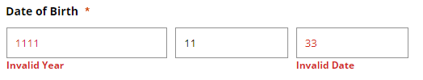

# 에러가 발생했으나 알 수 없음

에러가 발생하여 에러메세지가 입력박스 하단에 선명하고 빨간색 폰트로 에러메시지를 보여주고 있지만, 스크린리더 사용자는 에러가 발생했는지 조차도 알 수가 없다.

### 문제발생

사용자의 생년월일을 입력하는 입력박스에 잘못된 숫자를 입력하였을 때, 에러가 발생하였지만 시각적으로 표현만 되었을 뿐 스크린리더 사용자는 인지하지 못한다.



```markup
<div id="birthlabel">Date of Birth</div> 
<div role="group" aria-labelledby="birthlabel">
  <div>
    <span id="placeholder-year" aria-hidden="true">YYYY</span>                                                
    <input type="text" title="4 digit year" aria-required="true">
    <p class="error">Invalid Year</p>
  </div>                                            
  <div>                                               
   <span id="placeholder-month" aria-hidden="true">MM</span>
   <input type="text" title="2 digit month" aria-required="true">                                   
  </div>                                            
  <div>
    <span id="placeholder-day" aria-hidden="true">DD</span>
    <input type="text" title="2 digit day" aria-required="true">
    <p class="error">Invalid Date</p>                                            
  </div>                                        
</div>    
```

에러가 발생하고 포커스가 첫번째 연도를 입력하는 인풋박스로 이동하지만, 스크린리더는 잘못된 입력값이라는 것도, 에러가 발생했다는 것도 읽지 않는다.

연도 입력박스로 포커스가 이동하면 아래와 같이 읽는다.

> Date of Birth grouping  
> 4 digit year edit required has auto complete  
> blank

### 해결방안

```markup
<span id="placeholder-year" aria-hidden="true">YYYY</span>                                                
<input type="text" title="4 digit year" aria-invalid="true" aria-describedby="error-1" aria-required="true" >
<p class="error" id="error-1">Invalid Year</p>                                     
```

에러가 발생한 입력박스에 aria-invaild="true"를 삽입하여 에러가 발생한 폼이라는 것을 알리고, 에러문구와 aria-describedby와 연결하여 포커스가 입력박스에 도달하면 에러문구를 읽도록 설정한다.

> Date of Birth grouping  
> 4 digit year edit required invalid entry Invalid year  
> blank


4자리 연도를 YYYY로 표현하는 경우가 많은데, JAWS에서는 연속된 글자를 개수에 맞게 모두 읽지 않기 때문에 4 digit year로 읽을 수 있게 하는 것이 좋다.



