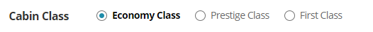

# 폼 요소의 그룹제목 미 제공

라디오버튼과 같이 두 개 이상의 그룹이 묶여 있는 경우에 시각적으로 그룹이라는 것이 표현이 되지만 스크린리더 사용자는 그 정보를 알 수가 없다.

### 문제발생

항공권 구매 시 좌석 등급을 선택해야 할 때, 이코노미/프레스티지/일등석을 라디오버튼으로 제작하였으나 그룹으로 묶지 않아 스크린리더 사용자는 그룹 정보를 인지하지 못한다.



```markup
<div id="classtxt">Cabin Class</div>
<ul>
    <li>
        <input id="economy" type="radio" value="economy" checked="checked" name="cabin">
        <label for="economy">Economy Class</label>
    </li>
    <li>
        <input id="Prestige " type="radio" value="Prestige" name="cabin">
        <label for="Prestige ">Prestige Class</label>
    </li>
    <li>
        <input id="First" type="radio" value="First" name="cabin">
        <label for="First">First Class</label>
    </li>
</ul>
```

스크린리더로 듣게 되면  전체 개수는 알 수 있지만 그룹 정보는 없다.

> Cabin Class  목록   
> 라디오버튼 선택됨 Economy Class 1/3  
> 라디오버튼 해제됨 Prestige Class 2/3   
> 라디오버튼 해제됨 First Class 3/3

### 해결방안

ARIA role="group"과 aria-labelledby를 사용하여 그룹으로 묶고 그룹 제목을 명시한다.

```markup
<div id="classtxt">Cabin Class</div>
<ul role="group" arai-labelledby="classtxt">
    <li>
        <input id="economy" type="radio" value="economy" checked="checked" name="cabin">
        <label for="economy">Economy Class</label>
    </li>
    <li>
        <input id="Prestige " type="radio" value="Prestige" name="cabin">
        <label for="Prestige ">Prestige Class</label>
    </li>
    <li>
        <input id="First" type="radio" value="First" name="cabin">
        <label for="First">First Class</label>
    </li>
</ul>
```

> Cabin Class 그룹  
> 라디오버튼 선택됨 Economy Class 1/3   
> 라디오버튼 해제됨 Prestige Class 2/3   
> 라디오버튼 해제됨 First Class 3/3

