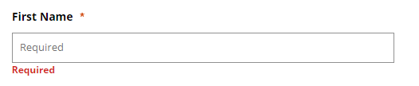

# 똑같은 말 반복하면 너무 불편해

### Required 의 3번 중복... 필수필수필수

입력 박스의 레이블과 입력 지침\(Placeholder\), 에러 메시지까지 동일한 문구로 제공하게 되면 스크린리더 사용자는 어떤 정보인지 구분을 할 수가 없어 사용이 어렵게 된다.

### 문제발생



이름을 입력하는 입력박스에 필수입력이라는 Required가 레이블과 Placeholder의 기능을 하고 있는 요소에 삽입되어 있고 에러가 발생해도 에러메시지 안에 동일하게 들어가 있다.

```markup
<label for="aa">First Name <span class="offscreen">Required</span></label>
<span class="placeholder" id="bb">Required</span>
<input type="text" id="aa" aria-describedby="bb error-txt">
<p class="error" id="error-txt">Required</p>
```

스크린리더로 읽게 되면 다음과 같이 들린다.

> First Name Required edit has auto complete Required Required

### 해결방안

필수입력항목은 레이블에만 Required 문구를 제공하고, Placeholder는 입력포맷이나 지침으로 변경하고 에러메시지는 필수입력정보라는 내용으로 변경하였다.

```markup
<label for="aa">First Name <span class="offscreen">Required</span></label>
<span class="placeholder" id="bb">ex)GIL DONG</span>
<input type="text" id="aa" aria-describedby="bb error-txt">
<p class="error" id="error-txt">This information is required.</p>
```

스크린리더로 읽게 되면 다음과 같이 들린다.

> First Name Required edit has auto complete   
> ex\)GIL DONG This information is required.

